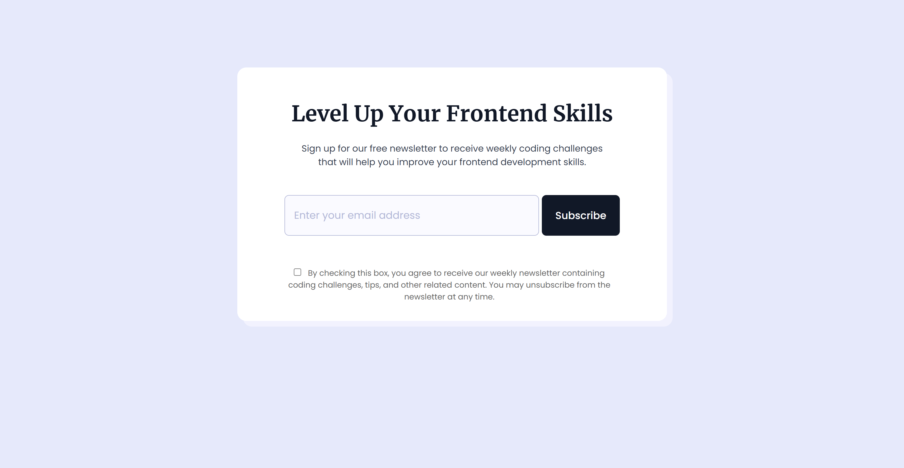

# Newsletter Card Component

## Project Overview

This project is a responsive **Newsletter Signup Card Component** created using HTML, SCSS, Bootstrap, and JavaScript. The component enables users to subscribe to a newsletter by entering their email address and accepting the terms and conditions. Upon successful subscription, a popup message is displayed to confirm the subscription. The component is fully responsive, providing an optimized experience on different screen sizes, including mobile devices.

### Challenge Source

This project is a solution for the [FrontendPro Newsletter Card Component Challenge](https://www.frontendpro.dev/frontend-coding-challenges/newsletter-card-component-Q3mJZ3AVwbEW4BEKYCKF).

## Features

- **Responsive Design**: Leverages Bootstrap and custom SCSS to ensure a seamless experience on devices of all sizes.
- **Email Validation**: Validates the email format before allowing the user to submit the form.
- **Terms Agreement**: Requires users to check a checkbox agreeing to the terms and conditions before subscribing.
- **Popup Confirmation**: Displays a thank-you popup message after successful submission.
- **Closeable Popup**: Allows users to close the popup via a close (×) button or by clicking outside the popup area.

## Technologies Used

- **HTML5**: For the structure of the component.
- **SCSS**: For modular, reusable, and scalable styling, with nesting and variables for flexibility.
- **Bootstrap**: For responsive grid and utility classes, reducing the need for custom CSS.
- **JavaScript (ES6)**: For form validation, dynamic popup display, and user interactions.

## Screenshot



## Live Demo

Explore the live version here: [Newsletter Card Component](https://yashi-singh-9.github.io/Newsletter-Card-Component/)

## Installation and Setup

To view or modify this project locally, follow these steps:

1. Clone the repository:

   ```bash
   git clone https://github.com/Yashi-Singh-9/Newsletter-Card-Component.git
   ```

2. Navigate to the project directory:

   ```bash
   cd Newsletter-Card-Component
   ```

3. Open the `index.html` file in your browser to view the component:

   ```bash
   open index.html
   ```

   Alternatively, use a local development server like the `Live Server` extension in Visual Studio Code.

### For Developers Editing SCSS

If you want to make changes to the SCSS file (`style.scss`), you’ll need to compile it into CSS. Here’s how:

1. **Install Node.js** (if you don’t already have it). Download it from [nodejs.org](https://nodejs.org/).

2. Install the Sass preprocessor globally:

   ```bash
   npm install -g sass
   ```

3. Compile the SCSS file into CSS:

   ```bash
   sass style.scss style.css
   ```

   This will overwrite the existing `style.css` file with the compiled CSS.

4. Reload the `index.html` file in your browser to see your changes.

## How It Works

1. **Form Submission**:
   - Users must provide a valid email and check the terms and conditions checkbox before submission.
   - The form uses JavaScript to validate the email format and ensure compliance with the terms.

2. **Popup Display**:
   - After successful form validation, a popup is displayed thanking the user for subscribing.
   - Users can close the popup by clicking the close (×) button or anywhere outside the popup.

3. **Responsive Layout**:
   - The component uses Bootstrap’s grid system and utility classes for responsiveness.
   - Custom SCSS media queries further refine the layout for mobile and tablet devices.

## Folder Structure

```bash
├── index.html             # Main HTML file
├── style.scss             # SCSS file for modular styles
├── style.css              # Compiled CSS file
├── script.js              # JavaScript file for validation and interactions
└── assets/                # Contains images, fonts, and other assets
```

## Customization

### Styling

To modify the design, edit the `style.scss` file. Key areas to customize:

- **Colors**: Update the `$primary-color`, `$background-color`, and other SCSS variables.
- **Typography**: Adjust the fonts by changing the `@import` statement for Google Fonts.
- **Spacing**: Modify margins, paddings, or grid gaps using Bootstrap classes or custom SCSS variables.

### JavaScript Logic

To adjust form or popup behavior, edit the `script.js` file. You can:

- Change the email validation pattern to fit your specific requirements.
- Customize the popup behavior, such as adding an auto-close feature.

## Responsiveness

This project combines Bootstrap’s responsive utilities and SCSS media queries to adapt the layout to various screen sizes. The design ensures:

- Inputs and buttons are aligned horizontally on larger screens.
- A stacked column layout is used on smaller screens for better usability.

## License

This project is open source and available under the [MIT License](LICENSE).

## Acknowledgments

Inspired by [FrontendPro Challenges](https://www.frontendpro.dev/) to enhance frontend development skills through hands-on coding exercises.
